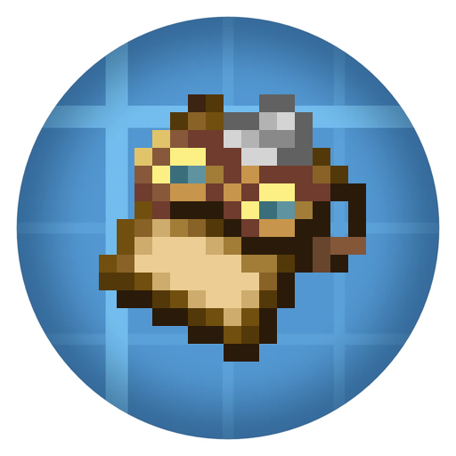
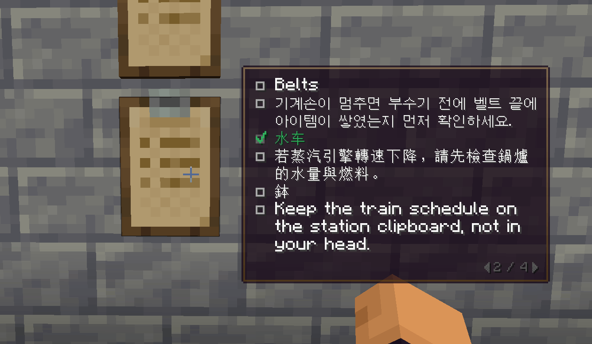

#  Create: Clipboard Glance

[English](README.md) | **한국어**

설치된 Create 클립보드를 우클릭해서 열지 않고도 한눈에 읽을 수 있어요!

설치된 클립보드를 바라보면 조준점 바로 옆에 Create 고글 오버레이 스타일로 페이지가 나타나요.

### 고글 없이도 작동해요!!!

## 기능

- 클립보드 본문 내용과 똑같이 생겼어요. 글, 체크박스, `#` 주소, 재료 목록이 미리보기로 Create 클립보드 화면과 똑같이 배치돼요.
- 페이지는 **Ctrl**을 누른 채 휠을 굴려 넘길 수 있어요.
- 미리 읽는 도중에 클립보드를 우클릭하면 읽던 페이지에서 클립보드가 열려요.

페이지 조작 키는 *설정 → 조작 → 키 지정 → Create: Clipboard Glance*에서 바꿀 수 있어요.

## 클라이언트 전용

클라이언트에 설치하면 바로 쓸 수 있어요!!! 서버에 본 모드가 없어도 Create가 있는 서버라면 작동하고, 굳이 서버에 추가할 필요는 없어요. 다른 플레이어에게도 영향을 주지 않아요.

## 요구 사항

| Minecraft | 로더 | Create |
| --- | --- | --- |
| 1.21.1 | NeoForge 21.1.219 이상 | 6.0.10 |
| 1.20.1 | Forge 47.1 이상 | 6.0.8 |

Sodium, Embeddium, Iris(셰이더 포함), ImmediatelyFast, Jade, Xaero's Minimap, ModernFix, FerriteCore 등등과 함께여도 동작해요(1.21.1에서 테스트).

## 빌드

Minecraft 버전마다 별도로 나눈 Gradle 프로젝트예요. JAR은 각 폴더의 `build/libs`에 만들게 되어있어요.

| 폴더 | Java | 명령 |
| --- | --- | --- |
| `neoforge-1.21.1` | 21 | `./gradlew build` |
| `forge-1.20.1` | 17 | `./gradlew build` |

## 크레딧

- Creators of Create 팀의 [Create](https://github.com/Creators-of-Create/Create)에 의존하는 팬 애드온입니다. Create 팀과 제휴하거나 보증받지 않았어요!
- HUD는 Create 고글 아이템 착용 시 오버레이의 스타일과 코드를 사용했어요(Create 코드: MIT 라이선스, © The Create Team / The Creators of Create).
- 아이콘 배경은 [Fandom의 Create 위키](https://create.fandom.com/wiki/Create_Addon_Mods)에서 가져온 "New Create Logo Background"(Bl4zerBo1XXXX, Create 로고 기반)이며 [CC BY-SA 3.0](https://creativecommons.org/licenses/by-sa/3.0/)를 따라요.
- 코드와 번역에 AI가 사용되었습니다. 아이콘과 GIF 등 이미지에는 AI가 사용되지 않았습니다.

## 라이선스

Copyright (c) 2026 potato815

이 애드온은 [CC BY-NC-SA 4.0](LICENSE) 라이선스를 따릅니다. CC BY-NC-SA 4.0에 더해 다음을 추가로 허락해요.

- 공식 배포본을 무료로 사용할 수 있는 모드팩에 넣을 수 있습니다.
- CurseForge·Modrinth 등이 모드팩 제작자에게 주는 리워드·수익 분배·광고 수익은 상업적 이용으로 보지 않습니다.
- 이 애드온과 이 애드온이 들어간 모드팩을 유료로 판매하거나, 결제·구독·후원으로만 제공하는 것은 허용하지 않습니다.
- 위와 같은 유료 판매 목적이 아니라면, 출처(potato815)를 밝히고 같은 라이선스로 공개하는 조건에서 자유롭게 수정 및 배포를 할 수 있습니다.

아이콘 이미지(`create_clipboard_glance_logo.png`)는 배경과 같은 CC BY-SA 라이선스로 공개해요. NeoForged MDK에서 온 Gradle 빌드 파일은 MIT 라이선스입니다(각 프로젝트 폴더의 `TEMPLATE_LICENSE.txt`). Create는 별도의 모드이며 이 저장소에 포함되지 않습니다.
